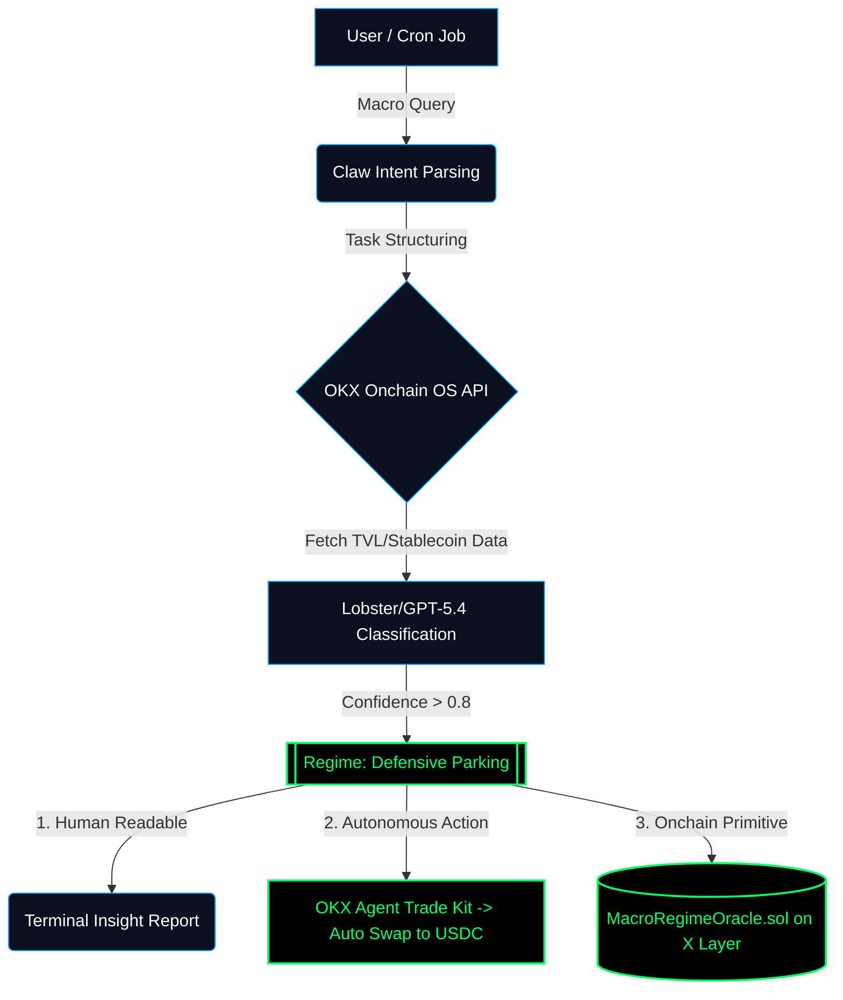

# OKX Onchain OS Macro Regime Mapper

A natural-language agent for onchain regime detection, regime shift tracking, and cross-ecosystem macro comparison.

Built with **OKX Onchain OS + Claw**  
Internal implementation note: **Lobster engine**

---

## Overview

Most onchain tools answer local questions.

They tell users what one wallet did, what one token did, or how active one ecosystem looks at a single point in time.

But users often need a bigger answer first:

**What kind of market are we actually in?**

**OKX Onchain OS Macro Regime Mapper** is designed to answer that question.

It turns broad macro questions into structured onchain analysis tasks, then maps the resulting signal bundles into readable market regimes.

Instead of generating noisy buy/sell calls, it provides a higher-level interpretation layer for understanding **capital deployment, rotation, defensive behavior, and narrative exhaustion** across onchain environments.

---

## Core Capabilities

### 1. Onchain Regime Detection
The system classifies current market conditions into readable states such as:

- Risk Expansion
- Risk Rotation
- Defensive Parking
- Narrative Exhaustion

### 2. Regime Shift Tracking
Beyond static classification, the project can track whether market behavior appears to be shifting from one regime to another.

Example:
- Previous regime: Defensive Parking
- Current regime: Risk Rotation

### 3. Cross-Ecosystem Comparison
The project can compare ecosystems in regime terms.

Examples:
- Base vs Ethereum
- Solana vs Ethereum

This makes it more than a single-point classifier.  
It becomes a macro reading layer for comparing how different onchain environments evolve.

### 4. Automated Regime-Based Execution (Trade Kit Integration)
Macro Regime Mapper is not just a read-only tool—it acts as an automated actuator. 
By integrating the **OKX Agent Trade Kit**, the system can trigger protective mechanisms automatically. For example, if `Defensive Parking` is detected with a confidence score > 0.85, the Agent can construct a risk-off Swap routing on the fly (e.g., swapping tail-risk assets into USDC), achieving a millisecond-level closed loop from "macro perception" to "asset deployment."

### 5. The "Macro Oracle" Primitive (X Layer)
We serve smart contracts, not just human traders. The system pushes periodic Regime classifications (e.g., `uint8 regimeType`) directly onto X Layer as an "Onchain Macro Oracle." 
Future DeFi lending protocols and yield aggregators can read this oracle to achieve "Macro Autopilot" (e.g., automatically raising liquidation thresholds during a `Narrative Exhaustion` regime to protect the protocol).

## Example Questions

Users can ask questions like:

- Is the market currently in risk expansion or defensive parking?
- Are stablecoins being redeployed into risk or staying idle?
- Did the market shift from defensive parking to risk rotation?
- Compare Base and Ethereum in current regime terms
- Which ecosystem shows stronger capital stickiness right now?

---

## Workflow

1. The user asks a macro question in natural language
2. **Claw** parses the question into a structured analysis intent
3. **OKX Onchain OS** routes the onchain workflow and signal collection
4. The internal regime engine maps signal bundles into readable states
5. A concise report is returned with explanation and confidence

### Full Execution Loop



## Why This Project

Onchain data is abundant.

What is scarce is **macro interpretation**.

Dashboards can show activity.  
Wallet trackers can show movement.  
Screeners can show volume.

But few tools answer a more useful higher-level question:

- Is capital truly deploying?
- Is risk appetite broadening?
- Is liquidity present but still defensive?
- Is attention visible while participation weakens underneath?

Macro Regime Mapper aims to provide that missing interpretation layer.

---

## Architecture

### Components

- **Claw Parser**  
  Converts natural-language macro questions into structured analysis intents

- **OKX Onchain OS Workflow Layer**  
  Handles signal routing and onchain workflow execution

- **Regime Engine**  
  Maps signal bundles into regime labels

- **Shift Detector**  
  Detects regime transitions between previous and current signal states

- **Comparison Engine**  
  Compares ecosystems in regime terms

- **Report Formatter**  
  Returns concise human-readable outputs with confidence
- **OKX Agent Trade Kit Executor (Action Layer)**
  Executes automated asset rebalancing (e.g., swapping to stablecoins) when highly confident defensive regimes are triggered.

- **MacroRegimeOracle.sol (Onchain Primitive)**
  A smart contract deployed on X Layer that stores the latest regime state, acting as a public macro oracle for other DeFi protocols.
---

## Repository Structure

```bash
okx-macro-regime-mapper/
├─ README.md
├─ requirements.txt
├─ .env.example
├─ prompts/
│  └─ macro_regime_prompt.md
├─ config/
│  └─ sample_queries.json
├─ src/
│  ├─ app.py
│  ├─ regime_engine.py
│  ├─ comparison_engine.py
│  ├─ shift_detector.py
│  ├─ data_adapter.py
│  └─ report_formatter.py
├─ demo/
│  ├─ demo_questions.md
│  ├─ demo_outputs.md
│  └─ comparison_demo.md
└─ assets/
   └─ cover.png
```
Prompt Design

The project uses a structured prompt pattern to keep outputs focused on market context rather than direct trading instructions.

Prompt responsibilities:

identify the macro intent
determine the relevant signal dimensions
map outputs into regime classes
generate short readable explanations
avoid behaving like a signal bot

See:

prompts/macro_regime_prompt.md
Sample Regime Classes
Risk Expansion

Capital is deploying with broader participation and stronger risk appetite.

Risk Rotation

Capital is beginning to move from defensive posture into selected risk areas.

Defensive Parking

Stablecoin presence or defensive capital is increasing faster than broad deployment.

Narrative Exhaustion

Attention remains visible, but participation breadth and follow-through are fading.

Example Output

```bash
result = {
    "question": "Risk expansion or defensive parking?",
    "regime": "Defensive Parking",
    "summary": "Stablecoin presence is rising faster than broad risk deployment.",
    "read": "Capital is onchain, but conviction remains shallow.",
    "confidence": 0.81
}
```
Comparison Output

```bash
comparison_result = {
    "question": "Compare Base and Ethereum in current regime terms",
    "base_regime": "Risk Rotation",
    "ethereum_regime": "Defensive Parking",
    "difference": "Base shows earlier-stage risk deployment and stronger speculative re-entry.",
    "confidence": 0.79
}
```
Regime Shift Output

```bash
shift_result = {
    "previous_regime": "Defensive Parking",
    "current_regime": "Risk Rotation",
    "shift_detected": True,
    "reason": "Stablecoin deployment accelerated while participation breadth improved.",
    "confidence": 0.77
}
```

Running the Demo
1. Clone the repo
   
```bash
git clone https://github.com/YOUR_USERNAME/okx-macro-regime-mapper.git
cd okx-macro-regime-mapper
```
2. Install dependencies
```bash
pip install -r requirements.txt
```
3. Set environment variables

Create a .env file based on .env.example
```bash
OKX_API_KEY=your_okx_key_here
OKX_API_SECRET=your_okx_secret_here
CLAW_MODEL=OpenClaw
LLM_VERSION=Gemini-3.1-Pro
```
Demo Scope

This repository is packaged as a reproducible prototype.

It includes:

prompt structure
workflow logic
sample queries
example outputs
code skeleton
comparison demo
regime shift demo
visual assets for presentation

The goal of this version is to demonstrate system design, workflow structure, and interaction logic for onchain macro interpretation.
Demo Questions
Risk expansion or defensive parking?
Are stablecoins being redeployed into risk or staying idle?
Compare Base and Ethereum in current regime terms
Did the market shift from defensive parking to risk rotation?
Which ecosystem shows stronger capital stickiness right now?

See:

demo/demo_questions.md
demo/comparison_demo.md
Reproducibility

This project is structured for easy reproduction.

Included:

prompt file
repo structure
sample input questions
example outputs
minimal Python workflow
short video demo
Carbon-based logic screenshots
Use Case

This project is intended for users who want a readable macro layer on top of onchain behavior, including:

onchain researchers
ecosystem analysts
strategy builders
users comparing ecosystem quality
builders exploring AI-driven interpretation layers on OKX Onchain OS
Notes
This project does not aim to behave like a trading signal bot
It does not provide direct buy/sell recommendations
It focuses on market context, capital behavior, and readable regime interpretation
Built With
OKX Onchain OS
Claw
Python
Internal implementation label: Lobster engine
Submission Metadata
Project Name: OKX Onchain OS Macro Regime Mapper
Claw Model: OpenClaw
LLM Version: Gemini 3.1 Pro
Use Case: Natural-language onchain regime detection, shift tracking, and ecosystem comparison

Replace the model/version fields above with the exact versions you actually used before submission.
